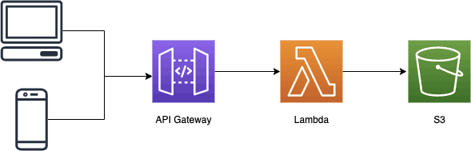

[](https://aws.amazon.com/cdk/)
# A serverless app using AWS CDK

This is a serverless project using TypeScript with AWS CDK.

## Requirements

* Node version 14 or later
* npm version 7 or later
* awscli v2
* [AWS CDK Toolkit](https://aws.amazon.com/cdk/)

## Components

* AWS API Gateway
* AWS Lambda Function
* AWS S3 Bucket

## Architecture


## Getting Started

To start the Development, run `npm install` to setup the package dependencies in the root project. 


## Useful Commands
The `cdk.json` file tells the CDK Toolkit how to execute your app.

 * `npm run build`   compile typescript to js
 * `npm run watch`   watch for changes and compile
 * `npm run test`    perform the jest unit tests
 * `cdk deploy`      deploy this stack to your default AWS account/region
 * `cdk diff`        compare deployed stack with current state
 * `cdk synth`       emits the synthesized CloudFormation template

## Building

To build the project, run `npm run build` in the root project. This command will run npm run build on all packages.

See [AWS CDK Documentation](https://docs.aws.amazon.com/cdk/api/latest/) for more information.

## Testing

We have Unit tests to check the components created by the CDK Stack.

* Snapshot Test

* Assertion Test
  * Creation of S3 Bucket
  * Creation of ApiGateway
  * Creation of Lambda Funtion

### Steps for Testing

* Install the dependencies
```
npm install
```

* Run the tests
```
npm run build && npm test
```

## Development

The repository can be cloned for local development.

## License

MIT License